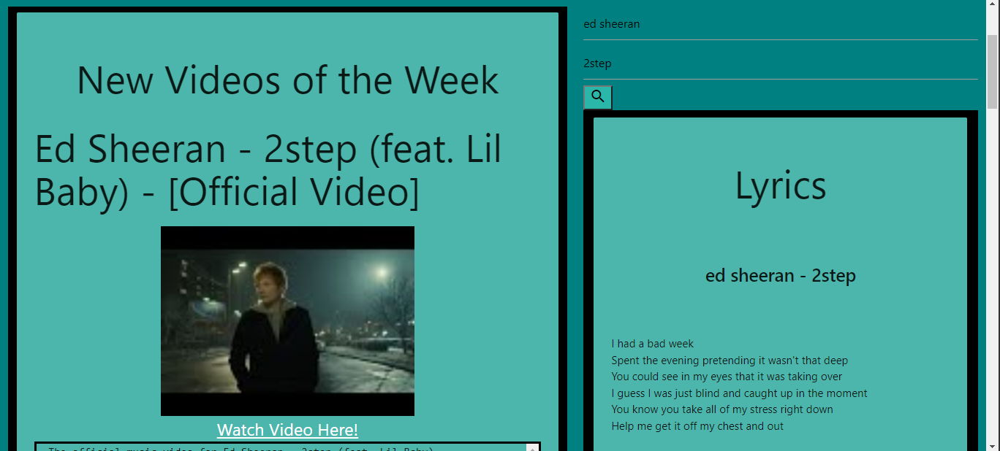

# "TRENDING music"

## Desctiption

This application is is designed to discover trending music. The application uses the YouTube API to pull data from a new music playlist. From the playlist the user is presented with the title of the video, the video thumbnail, a link to watch the video, and a description of the video. Due to Google security measures when the "press First & Close Pop-up" button is pressed, an error message is displayed however, once the "Press Second & Display New Music" button is pressed the music video data is displayed.

The application also uses the OVH lyrics API to return song lyrics through a search function. The responsive design was developed using Materialize.

## Built With

- HTML
- CSS
- Materialize
- Javascrip

## Website

https://ajpicc3734.github.io/Group-Project/

## ScreenShot

